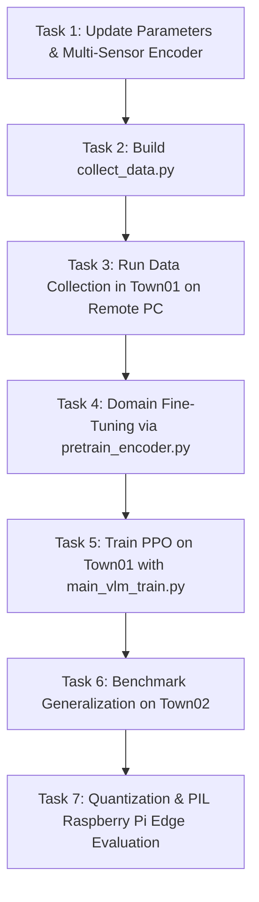

# Master Plan: Multimodal Foundation VLM-PPO Autonomous Driving System

## 1. System Architecture & High-Level Design

Our system unifies **5 sensor modalities** with a **Pre-trained Multimodal Foundation Model** (DINOv2 / SigLIP + Qwen2-0.5B + Wav2Vec2) and a **PPO Reinforcement Learning Policy** trained on **CARLA Town01** and benchmarked on **Town02**.

```
┌────────────────────────────────────────────────────────────────────────────────────────┐
│                                 5 SENSOR INPUT MODALITIES                              │
├──────────────────────┬──────────────────────┬──────────────────────┬───────────────────┤
│ 1. 📷 3x RGB Cameras │ 2. 📡 3D LiDAR       │ 3. 🎙️ Spoken Audio   │ 4. 🛰️ IMU / GNSS  │
│ • Front (125° FOV)   │ • 64-Channel RayCast │ • 16 kHz Mono (.mp3) │ • Velocity (km/h) │
│ • Left (-60° Yaw)    │ • Projected to 2D    │ • Aanchal's Dataset  │ • Angle to Waypnt │
│ • Right (+60° Yaw)   │   BEV Grid (160x80)  │ • Multi-accent voice │ • Dist from Center│
└──────────┬───────────┴──────────┬───────────┴──────────┬───────────┴─────────┬─────────┘
           │                      │                      │                     │
           ▼                      ▼                      ▼                     │
┌──────────────────────┬──────────────────────┬──────────────────────┐         │
│ Shared Visual Patch  │ Shared BEV Distance  │ Wav2Vec2 + Projector │         │
│ Embedder (DINOv2)    │ Patch Embedder       │ Qwen2-0.5B Embedding │         │
└──────────┬───────────┴──────────┬───────────┴──────────┬───────────┘         │
           │                      │                      │                     │
           └──────────────────────┼──────────────────────┘                     │
                                  │                                            │
                                  ▼                                            │
┌────────────────────────────────────────────────────────────────────────┐     │
│       MULTIMODAL FOUNDATION VLM (DINOv2 / SigLIP + Qwen2 Backbone)     │     │
│  • Cross-modal Attention between Visual, BEV, and Language Tokens     │     │
│  • Domain fine-tuned on CARLA Town01 (LoRA / Auxiliary Steering Heads) │     │
│  • Outputs: Dense Spatial-Linguistic Representation                    │     │
└─────────────────────────────────┬──────────────────────────────────────┘     │
                                  │                                            │
                                  ▼                                            │
       [ 128 / 256-dim Multimodal Latent Vector ]                              │
                                  │                                            │
                                  └──────────────────────┬─────────────────────┘
                                                         │
                                                         ▼
                                [ Unified 133 / 261-dim State Vector ]
                                                         │
                                                         ▼
                                  [ PPO Actor-Critic Driving Policy ]
                                                         │
                                                         ▼
                                 [ Continuous Actions: Steer, Throttle, Brake ]
                                                         │
                                                         ▼
                               [ CARLA Closed-Loop World (Town01 -> Town02) ]
```

---

## 2. Technical Specifications & Model Roster

| Component | Model / Technology | Parameters | Output / Role |
|---|---|---|---|
| **Acoustic Backbone** | `facebook/wav2vec2-base-960h` | 95M | 768-dim sound embeddings from speech |
| **Language Backbone** | `Qwen/Qwen2-0.5B` | 494M | Semantic command intent & text tokens |
| **Audio-LLM Projector** | 2-Layer MLP (768 $\rightarrow$ 896) | 1.7M | Aligns audio into Qwen token space |
| **Visual Backbone** | `Meta DINOv2-Small` / `SigLIP` | 21M / 86M | Spatial patch tokens from 3 cameras |
| **LiDAR Processor** | 2D BEV Projection ($160\times 80$) | 0 (Geometric) | 2D obstacle distance grid map |
| **Multimodal Fusion** | `MultimodalEdgeEncoder` | ~250K–1.5M | Fuses Vision + BEV + Audio $\rightarrow$ 128/256-dim latent |
| **RL Policy** | PPO Actor-Critic (MLP) | ~350K | Maps state vector $\rightarrow$ [Steer, Throttle, Brake] |
| **Training World** | CARLA 0.9.x **Town01** | — | Training & LoRA fine-tuning environment |
| **Testing World** | CARLA 0.9.x **Town02** | — | Zero-shot cross-map generalization test |

---

## 3. Audit of Existing Codebase: What Needs Updating

| File | Current Status | Action Required |
|---|---|---|
| `parameters.py` | Set to `OBSERVATION_DIM=100`, `Town02`, 1 camera | **UPDATE:** Set `TOWN='Town01'`, `OBSERVATION_DIM=133` (or 261), add 3-camera + LiDAR parameters. |
| `multimodal_encoder.py` | 106K scratch single-camera PyTorch module | **UPDATE:** Upgrade to support 3 RGB cameras + 2D BEV LiDAR + Foundation Model embedding integration + configurable latent output (128/256-dim). |
| `main_vlm.py` | Dummy architecture verification script | **UPDATE:** Align with multi-camera + BEV LiDAR pipeline. |
| `test_vlm_carla.py` | Single-camera CARLA test script | **UPDATE:** Add 3-camera + LiDAR actor spawning in CARLA. |
| `PIL_edge_vlm.py` | Basic socket edge client | **UPDATE:** Align socket packet structure with multi-sensor tensor formats. |
| `benchmark_latency.py`| Single-camera latency test | **UPDATE:** Benchmark 3-camera + LiDAR + speech execution latency. |
| `collect_data.py` | ❌ Missing | **CREATE:** Synchronous multi-sensor data collector in Town01. |
| `pretrain_encoder.py`| ❌ Missing | **CREATE:** Domain adaptation / steering prediction fine-tuner. |
| `main_vlm_train.py` | ❌ Missing | **CREATE:** Full PPO training script for Town01 with Town02 testing mode. |

---

## 4. Step-by-Step Task Completion Guide (Operational Manual)



### Phase 1: Local Code Construction & Upgrade (Mac - Today)
* **Task 1.1:** Update `parameters.py` with multi-camera FOVs, Town01 default, and new dimension constants.
* **Task 1.2:** Upgrade `multimodal_encoder.py` to support multi-view fusion (Front, Left, Right), 2D BEV LiDAR grid input, and Aanchal's speech taxonomy.
* **Task 1.3:** Build `collect_data.py` to automate multi-sensor synchronized data gathering from CARLA's Autopilot/Traffic Manager in Town01.
* **Task 1.4:** Build `pretrain_encoder.py` to perform supervised domain adaptation (steering & speed prediction) on the collected Town01 dataset.
* **Task 1.5:** Build `main_vlm_train.py` integrating the fine-tuned perception encoder with PPO Actor-Critic for closed-loop training.

### Phase 2: Remote Data Gathering & Fine-Tuning (Remote PC)
* **Task 2.1:** Transfer updated scripts via AnyDesk.
* **Task 2.2:** Run `python collect_data.py --town Town01 --frames 20000` under 4 weather conditions.
* **Task 2.3:** Run `python pretrain_encoder.py --epochs 40` to produce `pretrained_vlm_encoder.pth`.

### Phase 3: PPO Training on Town01
* **Task 3.1:** Launch PPO training: `python main_vlm_train.py --mode train --town Town01 --timesteps 1000000`.
* **Task 3.2:** Monitor TensorBoard metrics (Reward curve, Episode length, Steering smoothness).

### Phase 4: Zero-Shot Generalization & Benchmarking on Town02
* **Task 4.1:** Run test evaluation: `python main_vlm_train.py --mode test --town Town02 --episodes 50`.
* **Task 4.2:** Compute comparative metrics against baseline `Results_05/test_results_gpu.csv` (Route Completion %, Collision Rate, Speed).

### Phase 5: Processor-in-the-Loop (PIL) & Raspberry Pi Edge Deployment
* **Task 5.1:** Quantize model weights to INT8 / FP16 (`convert_vlm.py`).
* **Task 5.2:** Run `PIL_simulation.py` on Remote PC and `PIL_edge_vlm.py` on Raspberry Pi over TCP socket.
* **Task 5.3:** Compare edge latency against baseline `PIL_test_results_16bit.csv` (110–325 ms target to beat).
